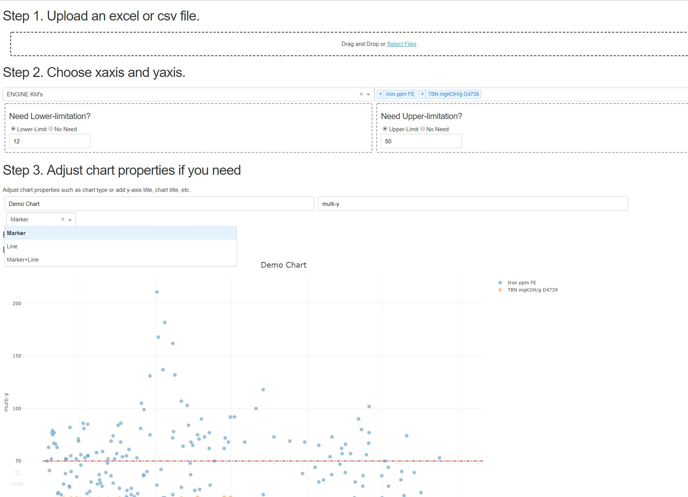

### python Dash exploration

A set of scripts to explore the usage of python Dash.

Right now, the script "uplod.py" is already archived. You can run this script under any python environment (python3 preferred).

It will give an interface like below:

You can then upload any Excel or CSV table (must have no empty rows at the beginnig) and you can choose any features you're interested then to check the scatter chart which generated automatically.

The file "exploration.py", which focusing on flash_cache usage, is still under developing.

----------

Necessary libraries (latest version after 7/1/2019):

numpy

pandas

plotly

dash

dash_core_components

dash_core_html

dash_auth

dash_table

flask_caching